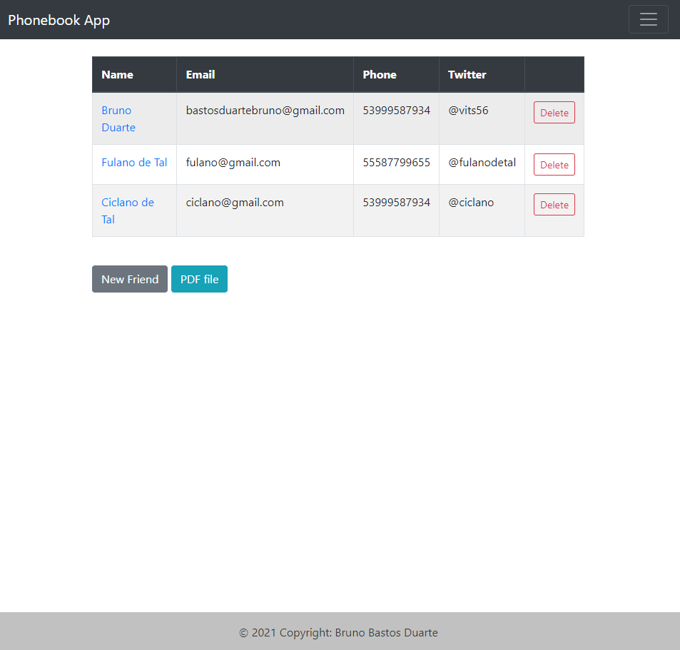

# Phonebook



> Aplicação desenvolvida com rails 6, uma agenda telefônica que guarda nome, telefone, email e usuário do twitter e tem a opção de imprimir em pdf.

## 💻 Pré-requisitos

* Você tera que ter o git instalado na sua maquina.
* Você instalou a versão  ` Ruby '3.0.2' | Rails '6.1.4'`. 
* Você tem uma máquina `< Linux / Mac>`.

## 🚀 Instalando <Phonebook>

Clone este repositório:
```
git clone https://github.com/vits56/phonebook-heroku
```

Instale as Gems:
```
bundle
```

Instale  as dependências:
```
yarn install
```

Migre o Banco de Dados:
```
rails db:migrate
```


> ### Caso queira ver a aplicação no ar:
> [Phonebook](https://github.com/vits56/phonebook-heroku)


## License

This project is under license from MIT. For more details, see the [LICENSE](LICENSE.md) file.

Made with 💜 by <a href="https://github.com/vits56" target="_blank">Bruno Bastos Duarte</a>

&#xa0;

<a href="#top">Back to top</a>